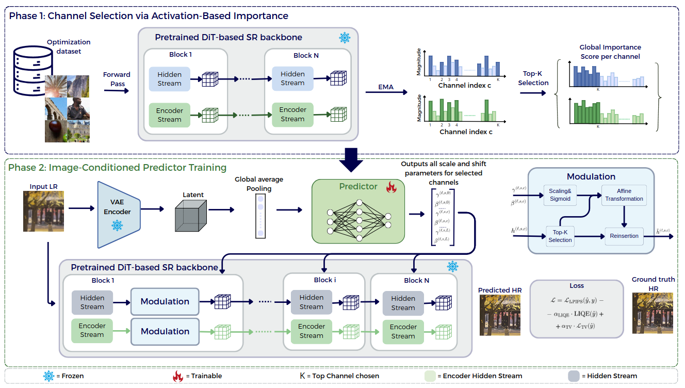

# SPARK: Input-Conditioned Sparse Activation Modulation for Frozen DiT-based Super-Resolution

<p align="center">
  <a href="https://arxiv.org/abs/2609.03813">
    
  </a>
</p>

SPARK improves the perceptual quality of DiT-based super-resolution models without
touching their weights. It identifies the few channels that dominate the activation
space of each block, then trains a lightweight input-conditioned predictor that
applies bounded per-channel affine modulation to only those channels. The SR
backbone and the VAE stay frozen, so the adaptation is fast, small, and
plug-and-play.

This repository contains the implementation for the **TSD-SR** backbone.



---

## Installation

Requires **CPython 3.11** and one GPU with **>= 48 GB** of memory.

```bash
curl -LsSf https://astral.sh/uv/install.sh | sh     # install uv (once)

cd spark
export UV_CACHE_DIR=$PWD/.uv-cache
# on a network filesystem (NFS/Lustre/BeeGFS) also: export UV_LINK_MODE=copy

uv venv --python 3.11
uv sync
source .venv/bin/activate
```

## Pretrained weights

Download both, neither is redistributed here:

1. **Stable Diffusion 3 Medium** (diffusers layout) — gated on HuggingFace; accept
   the licence, then

   ```bash
   huggingface-cli download stabilityai/stable-diffusion-3-medium-diffusers \
     --local-dir checkpoints/stable-diffusion-3-medium-diffusers
   ```

2. **TSD-SR LoRA weights and prompt embeddings** — from the
   [official TSD-SR release](https://github.com/Microtreei/TSD-SR). Use the
   `checkpoint/tsdsr-mse` LoRA and the `dataset/default` embeddings.

Arrange them as:

```
checkpoints/
├── stable-diffusion-3-medium-diffusers/
└── tsdsr/
    ├── lora/            # TSD-SR LoRA
    └── embeddings/      # prompt embeddings
```

## Usage

Point the scripts at your checkpoints and data once:

```bash
source scripts/env.sh    # sets SD3_MODEL_PATH, TSDSR_LORA_DIR,
                         # TSDSR_EMBEDDING_DIR, DATA_ROOT, OUTPUT_ROOT
```

`DATA_ROOT` must hold `DRealSR/`, `RealSR/` and `DIV2K/` (each with their LR/HR
folders) plus the `DIV2K_train/` crops used for training.

### Training

```bash
bash scripts/train_predictor.sh topk8_paper
```

Runs channel selection and predictor training end to end, and writes the trained
predictor to `outputs/topk8_paper/reports/`.

### Evaluation

```bash
# frozen TSD-SR baseline
bash scripts/eval_baseline.sh DRealSR

# TSD-SR + SPARK
bash scripts/eval_predictor.sh outputs/topk8_paper DRealSR
```

Replace `DRealSR` with `RealSR` or `DIV2K`. Each run writes the SR images under
`images/` and the scores under `reports/*_metrics_summary.json`.

---

## Acknowledgements

This code builds on [TSD-SR](https://github.com/Microtreei/TSD-SR) and
[OSEDiff](https://github.com/cswry/OSEDiff). We thank the authors for releasing
their work.

## Licence

Apache 2.0 — see [`LICENSE`](LICENSE).
